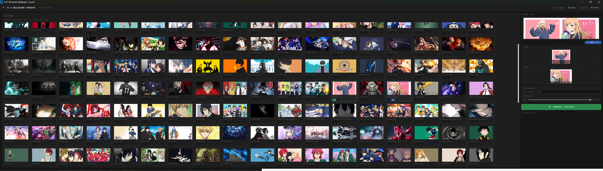

# 32:9 Ultrawide Wallpaper Creator

A desktop tool for combining two 16:9 wallpapers into a single **10240×2880** image for ultrawide 32:9 monitors (Samsung Odyssey G9/G9 Neo, etc.).


## Preview



## Features

- **Visual thumbnail grid** — browse and pick wallpapers by sight
- **L / R slot assignment** — click a card to auto-assign, or click the `L` / `R` badge to force a specific side
- **Drag-to-crop picker** — drag a 16:9 crop box directly on each image to choose the framing
- **Per-image rotation** — rotate source images in 90° steps before cropping
- **Live 32:9 preview** — see the combined result before generating
- **10240×2880 JPEG output** (each half: 5120×2880), adjustable quality (60–100)
- Auto-creates `compiled/` output subfolder if not set manually

## Supported input formats

`JPG` · `PNG` · `WEBP` · `BMP` · `TIFF`

## Installation

```bash
pip install -r requirements.txt
python main.py
```

## Usage

1. Click **📁 Input** — select folder with source wallpapers
2. Click a card to assign it as **LEFT** then another as **RIGHT**
   *(or click the `L` / `R` badge on any card to force-assign directly)*
3. Drag the crop box to adjust framing; use **↻ 90°** to rotate if needed
4. Optionally set a custom output filename and JPEG quality
5. Click **⚡ GENERATE 10240×2880**

Output saves to `<input_folder>/compiled/` by default, or a custom **📂 Output** folder.

## Project structure

```
image_compiller/
├── main.py              # entry point
├── requirements.txt
├── ui/
│   ├── app.py           # main window & logic
│   └── widgets.py       # ThumbnailCard, CropRegionPicker, PairPreview
└── core/
    └── processor.py     # image processing pipeline
```

## Build (standalone .exe)

```bash
pip install pyinstaller
pyinstaller --onefile --noconsole --collect-all customtkinter --icon=icon.ico --name "UWC
" main.py
```

Output: `dist/WallpaperCompiler.exe`

## Requirements

- Python 3.10+
- `customtkinter >= 5.2.0`
- `Pillow >= 10.0.0`
